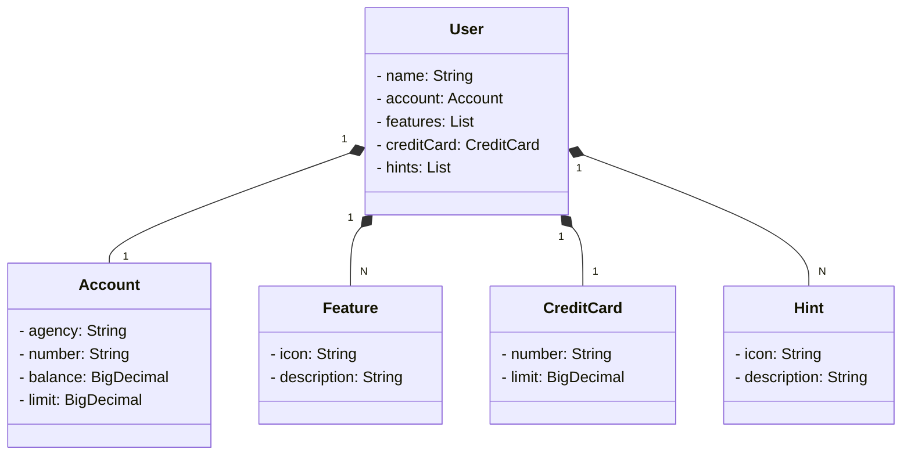

# **Santander Dev Week 2023**

**RESTful API da Santander Dev Week 2023 construída em Java 17 com Spring Boot 3.**

**Descrição**

Este repositório contém uma API de gerenciamento de usuarios de um banco desenvolvida durante a Santander Dev Week 2023. A API fornece um conjunto de endpoints para realizar operações básicas, como:

* Criação de conta de usuário
* Atualizar usuário
* Deletar usuário
* Listar todos os usuários
* Consultar um usuário


**API rodando online:** 
<br>
```https://juliocodes.tech/``` 
<br>
**Interface SWAGGER da API online:**
<br>
[https://juliocodes.tech/swagger-ui/index.html](https://juliocodes.tech/swagger-ui/index.html)


<div align="center">

**Tecnologias**

[](https://docs.oracle.com/en/java/)
[](https://docs.spring.io/spring-boot/docs/current/reference/htmlsingle/)
[](https://spring.io/projects/spring-data-jpa)
[](https://swagger.io/)
[](https://https://railway.app)
[](https://www.postgresql.org/)

</div>

## Diagrama de Classes



**Instalação**

Para instalar a API, siga estas etapas:

1. Clone o repositório:

```
git clone https://github.com/julioreigen/santander-dev-week-2023.git
```

2. Entre na pasta do projeto:

```
cd santander-dev-week-2023
```

3. Crie um arquivo `application.properties` na pasta `src/main/resources` com o seguinte conteúdo para banco de dados H2:

```
spring:
  datasource:
    url: jdbc:h2:mem:testdb
    username: julio
    password: 123
  jpa:
    show-sql: true
    open-in-view: false
    hibernate:
      ddl-auto: create # validate / update / create / create-drop
    properties:
      hibernate:
        format_sql: true
  h2:
    console:
      enabled: true
      path: /h2
      settings:
        trace: false
        web-allow-others: false
```

4. Construa a imagem do Docker:

```
docker build -t santander-dev-week-2023:latest .
```

5. Execute a imagem do Docker:

```
docker run -p 8080:8080 santander-dev-week-2023:latest
```

A API estará disponível em http://localhost:8080.

**Documentação**

A documentação da API está disponível no endereço [http://localhost:8080/swagger-ui/index.html](http://localhost:8080/swagger-ui/index.html)

**Exemplos**

Aqui estão alguns exemplos de como usar a API:

**Criar uma conta**

```
POST /users
```

Corpo da requisição:

```
{
  "name": "Julio Brito",
  "account": {
    "number": "000b0000-9",
    "agency": "0001",
    "balance": 1504.22,
    "limit": 1000.00
  },
  "creditCard": {
    "number": "xxxx xxxx xxxx 0022",
    "limit": 1000.00
  },
  "hints": [
    {
      "icon": "https://seusite.com/invest.png",
      "description": "Veja nossas novas formas de investimento"
    }
  ],
  "features": [
    {
      "icon": "https://seusite.com/pagar.png",
      "description": "Pagar"
    },
    {
      "icon": "http://seusite.com/pix.png",
      "description": "Pix"
    }
  ]
}
```


**Consultar usuário**

```
GET /users/{id}
```

Parâmetros:

* `id`: ID do usuário


**Consultar todos os usuários**

```
GET /users
```
